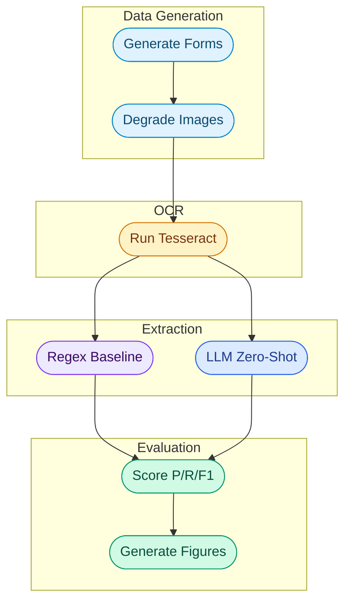

<div align="center">

# Kairo Health

### OCR Noise Effects on Medical Record Information Extraction


**University of Maryland, College of Information - INST664: Applied NLP - Final Project**

[Headline Findings](#headline-findings) · [Pipeline Stages](#pipeline-stages) · [Data and Sources](#data-and-sources) · [Future Work](#next-steps-and-future-considerations)
 
---
 
</div>

## Project Overview

Kairo Health started from a question I have been carrying since cofounding Frontground, a startup that builds a personalized mobile electronic medical record system to digitize paper records in low resource clinics. Mobile capture and cloud storage solve part of the problem, but they leave the harder upstream gap untouched: once you have a photograph of a paper record, how do you actually use it? A blurry JPEG of a triage form is not the same as structured patient data. This project is a controlled study of that conversion step.

The pipeline generates synthetic pediatric triage forms modeled on the Médecins Sans Frontières (MSF) Aweil Pediatric Triage form, renders each form at three OCR noise tiers (clean, moderate, heavy), runs Tesseract OCR on every image, and then compares two extraction methods on the resulting OCR text: a rule based regex baseline and an LLM zero-shot extractor using Claude Sonnet 4.5. The evaluation reports precision, recall, and F1 at the field level and across noise tiers, with per-field heatmaps that show exactly where each method breaks.

> **Core question:** As OCR input quality degrades, does LLM-based field extraction remain more robust than a rule based baseline, and where does the gap between the two methods live?

The headline finding is that the methods are competitive on clean and moderate inputs but diverge sharply at heavy noise. The robustness gap is concentrated in recall, not precision: the LLM finds nearly the same proportion of fields under heavy noise as it does under clean OCR, while the regex baseline collapses on checkbox-dependent fields where its bracket anchored patterns fail entirely.

---

## Headline Findings

| Noise level | Rules F1 | LLM F1 | Rules recall | LLM recall |
|---|---|---|---|---|
| Clean | 0.93 | 0.91 | 0.90 | 0.91 |
| Moderate | 0.92 | 0.92 | 0.89 | 0.92 |
| Heavy | **0.85** | **0.90** | **0.75** | **0.89** |

The recall row tells the cleanest version of the story. LLM recall stays essentially flat across noise tiers (0.91 to 0.89). Rule-based recall collapses 15 points (0.90 to 0.75). Per field analysis traces the collapse to two checkbox dependent fields, `sex` and `triage_color`, where the regex baseline drops to F1 = 0.00 under heavy noise. The LLM, reading degraded checkbox text in context, recovers most of these fields.

See `results/f1_comparison.csv` for the full headline table and `results/*.png` for figures.

---

## Data and Sources

<details>
<summary><strong>Source Form</strong></summary>
 
<br>

The synthetic dataset is modeled on the MSF Aweil Pediatric Triage form, a clinical document used by Médecins Sans Frontières clinicians for pediatric triage in low resource settings. The form was selected because clinicians I interviewed during Frontground customer discovery, specifically at the MSF clinic in Monrovia, used a near identical variant. Grounding the synthetic data in a real form keeps the project connected to its motivating deployment context.

| Property | Description |
|---|---|
| Source | MSF Medical Guidelines |
| Form name | MSF Aweil Pediatric Triage |
| Use context | Pediatric outpatient triage in low resource clinics |
| Structural regions | Header / patient identifiers, color coded clinical assessment grid, vitals table, test and treat panel, observation log |

</details>

<details>
<summary><strong>Synthetic Data Generation</strong></summary>
 
<br>

The data is fully synthetic. Each form is filled with medically plausible patient data: ages sampled from a pediatric distribution (2–59 months), vitals in realistic ranges calibrated by age band, plausible presenting complaints, and triage classifications consistent with the sampled vital signs. The 14 evaluation fields are tracked as ground truth; decorative checkboxes (Emergency Signs, Priority Signs) are sampled to make forms look realistic but are not part of the extraction schema.

| Field type | Examples | Count |
|---|---|---|
| **Header / identifiers** | date, time, ampm, name, age, sex | 6 |
| **Free text** | presenting_complaint | 1 |
| **Checkbox classification** | triage_color | 1 |
| **Numeric vitals** | rr, hr, sat, temperature, weight, muac | 6 |
| **Total evaluation fields** | | **14** |

</details>

<details>
<summary><strong>OCR Noise Tiers</strong></summary>
 
<br>

Each PDF is rendered at three noise tiers via parameterized image degradation. The tiers are designed as controlled points along the input quality axis, calibrated empirically against Tesseract OCR.

| Tier | Rotation | Blur | Contrast | Smudges | Tint |
|---|---|---|---|---|---|
| Clean | 0° | 0px | 1.0 | 0 | none |
| Moderate | 0.5° | 0.5px | 0.85 | 0 | none |
| Heavy | 1.5° | 1.0px | 0.70 | 0 | yellow shift 10 |

Mean character error rates (CER) across 30 forms: clean 0.486, moderate 0.480, heavy 0.584. The absolute CER values are inflated by word-ordering mismatches between Tesseract's reading order and the reference text reconstruction; the relative ordering is what calibrates the experiment.

</details>

<details>
<summary><strong>Techniques</strong></summary>
 
<br>

| Technique | Library | Purpose |
|---|---|---|
| PDF generation | reportlab | Synthesize triage form PDFs |
| PDF to image | pdf2image (poppler) | Convert PDFs for OCR pipeline |
| Image degradation | PIL, numpy | Apply controlled noise per tier |
| OCR | pytesseract (Tesseract 5.x) | Extract raw text from noisy images |
| OCR error metrics | jiwer | Character error rate, word error rate |
| Rule based extraction | re (regex) | Baseline label anchored extraction |
| LLM extraction | anthropic API (Claude Sonnet 4.5) | Zero shot JSON mode extraction |
| Evaluation | pandas, matplotlib, seaborn | Precision/recall/F1, heatmaps, bar charts |

</details>

---

## Setup Instructions

### System dependencies

Tesseract OCR and Poppler must be installed at the system level before installing Python packages.

```bash
# macOS
brew install tesseract poppler

# Ubuntu/Debian
sudo apt-get install tesseract-ocr poppler-utils
```

For Windows, install [Tesseract](https://github.com/UB-Mannheim/tesseract/wiki) and [Poppler](https://github.com/oschwartz10612/poppler-windows/releases) and add both to PATH.

### Python environment

```bash
# 1. Clone the repository
git clone https://github.com/kennethyeaher/kairoHealth.git
cd kairoHealth

# 2. Create and activate a virtual environment
python -m venv .venv
source .venv/bin/activate

# 3. Install dependencies
pip install -r requirements.txt
python -m spacy download en_core_web_sm
```

### API key

The LLM extractor calls the Anthropic API. Copy the example env file and add your own key.

```bash
cp .env.example .env
# Edit .env and add your key (starts with sk-ant-)
```

> **NOTE:** Get a key at [console.anthropic.com](https://console.anthropic.com). Cost for the full 30-form pipeline is well under $1 in current Claude Sonnet 4.5 pricing.

---

## Running the Project

Run the pipeline end to end. Each command depends on the output of the previous.

```bash
python -m src.generate_forms       # 10 sec   PDFs + ground truth
python -m src.degrade_images       # 60 sec   3 noise tiers per PDF
python -m src.run_ocr              # 3 min    Tesseract + CER/WER
python -m src.extract_rules        # 5 sec    regex predictions
python -m src.extract_llm          # 5 min    LLM predictions
python -m src.evaluate             # 5 sec    tables + figures
```

Outputs land in `results/`. Open the headline figures with:

```bash
open results/f1_by_noise.png
open results/recall_by_noise.png
open results/rules_field_heatmap.png
open results/llm_field_heatmap.png
```

---

## Code Package Structure

| Type | Path | Description |
|---|---|---|
| **Folder** | **`src/`** | **Pipeline modules** |
| File | `generate_forms.py` | Synthesize MSF style triage PDFs |
| File | `degrade_images.py` | Render PDFs at 3 OCR noise tiers |
| File | `run_ocr.py` | Tesseract OCR with CER/WER calibration |
| File | `extract_rules.py` | Regex baseline extractor |
| File | `extract_llm.py` | LLM zero shot extractor (Claude API) |
| File | `evaluate.py` | Precision/recall/F1, tables, figures |
| **Folder** | **`data/`** | **Pipeline data artifacts** |
| File | `ground_truth.json` | Field values for each form (committed) |
| File | `ocr_results.json` | Raw Tesseract output (committed) |
| Subfolder | `pdfs/` | Generated forms (gitignored, regeneratable) |
| Subfolder | `images/` | Noisy renders (gitignored, regeneratable) |
| **Folder** | **`results/`** | **Tables and figures (committed)** |
| File | `f1_comparison.csv` | Headline P/R/F1 table |
| File | `per_field_f1.csv` | Per method, per noise, per field F1 |
| File | `ocr_calibration.csv` | Mean CER/WER per noise tier |
| File | `predictions_rules.json` | Regex predictions for all 90 documents |
| File | `predictions_llm.json` | LLM predictions for all 90 documents |
| File | `f1_by_noise.png` | Headline F1 bar chart |
| File | `recall_by_noise.png` | Recall bar chart (discussion figure) |
| File | `rules_field_heatmap.png` | Per field F1 heatmap, regex |
| File | `llm_field_heatmap.png` | Per field F1 heatmap, LLM |
| File | `config.py` | Paths, seeds, field schema, noise configs |
| File | `requirements.txt` | Pinned dependencies |
| File | `.env.example` | Template for API key configuration |

---

## Pipeline Stages



---

<details>
<summary><strong>1. Generate Forms</strong> — <code>data/pdfs/</code> + <code>data/ground_truth.json</code></summary>
 
<br>
 
Synthesizes 30 pediatric triage form PDFs using reportlab. Each form is filled with medically plausible patient data sampled with a fixed random seed for reproducibility. The 14 evaluation fields per form are written to ground_truth.json, which serves as the gold standard for evaluation.
</details>

<details>
<summary><strong>2. Degrade Images</strong> — <code>data/images/{clean,moderate,heavy}/</code></summary>
 
<br>
 
Renders each PDF at 200 DPI and applies one of three degradation pipelines (rotation, Gaussian blur, contrast reduction, paper-aging tint) parameterized in NOISE_CONFIGS. Output is 90 PNG images total. Tiers were calibrated empirically against Tesseract until the noise levels produced meaningfully different but readable OCR output.
</details>

<details>
<summary><strong>3. Run OCR</strong> — <code>data/ocr_results.json</code> + <code>results/ocr_calibration.csv</code></summary>
 
<br>
 
Runs Tesseract 5.x on each of the 90 images with light preprocessing (grayscale + 1.2x contrast, matching the chain reported by Hsu et al. 2022 for clinical OCR). Computes character error rate (CER) and word error rate (WER) per document against a reconstruction of the intended readable text. These metrics calibrate the noise tiers as a controlled experimental variable.
</details>

<details>
<summary><strong>4. Rule Based Extraction</strong> — <code>results/predictions_rules.json</code></summary>
 
<br>
 
Applies 14 regex patterns, one per evaluation field, to the OCR text. Patterns are anchored on field labels (DATE:, NAME:, RR:) and tuned on clean OCR output. They are applied unchanged at moderate and heavy noise to preserve the realistic deployment story: rule based systems are written once and encounter input they were not tuned for.
</details>

<details>
<summary><strong>5. LLM Extraction</strong> — <code>results/predictions_llm.json</code></summary>
 
<br>
 
Sends each OCR text to the Anthropic API with a zero shot prompt requesting JSON mode output matching the field schema. Uses Claude Sonnet 4.5. The prompt does not ask the model to correct OCR errors, only to extract values from the text it sees. Hallucinated keys outside the schema are dropped during postprocessing.
</details>

<details>
<summary><strong>6. Evaluate</strong> — <code>results/f1_comparison.csv</code> + figures</summary>
 
<br>
 
Computes true positives, false positives, and false negatives at the (method × noise × field) level. Wrong predictions count as both FP and FN because emitting a wrong value in clinical context is more dangerous than emitting nothing. Aggregates produce headline precision/recall/F1 per method per tier and per field F1 heatmaps.
</details>

---

## Reproducibility

All randomness is seeded via `RANDOM_SEED = 42` in `config.py`. Reruns of `generate_forms`, `degrade_images`, and `run_ocr` produce byte identical outputs given the same Tesseract version. LLM predictions vary slightly across runs because of API side sampling, but aggregate F1 metrics are stable to within about 1 point across reruns.

To scale the experiment beyond 30 forms, edit `N_FORMS` in `config.py` and rerun the full pipeline. The first 30 forms in any larger run are identical to the 30 form run because of the fixed seed.

| Stage | Reruns identical? | Notes |
|---|---|---|
| Form generation | Yes | Fully deterministic |
| Image degradation | Yes | Seeded random rotation and smudge placement |
| OCR | Yes | Tesseract is deterministic for fixed input |
| Regex extraction | Yes | Pure pattern matching |
| LLM extraction | No | API side sampling adds about 1 F1 point variance |
| Evaluation | Yes | Pure aggregation |

---

## Limitations

This is a synthetic data study. The forms are programmatically generated to match the layout of the MSF Aweil Pediatric Triage form, but they do not reflect real world conditions like handwriting, institutional variation, abbreviation drift in clinician shorthand, or photo capture conditions like skewed angles, poor lighting, or paper damage beyond the simulated blur, contrast, and tint here.

Results should be read as an upper bound on extraction quality achievable with clean printed templates. Field performance on real handwritten triage records is expected to be substantially lower for both methods. The synthetic ground truth also sidesteps the inter-annotator reliability concerns that would apply if real records were annotated by hand.

---

## Next Steps and Future Considerations

| Enhancement | Description | Impact |
|---|---|---|
| **Real form pilot** | Apply the pipeline to a small set of real (deidentified) triage forms from a partner clinic | Test whether the synthetic to real gap matches expectations |
| **Few shot LLM variant** | Add 2 in-context examples to the LLM prompt | Quantify the few-shot improvement over zero shot |
| **Handwriting OCR** | Swap Tesseract for a handwriting capable OCR (TrOCR, Google Document AI) | Address the largest gap between synthetic and real conditions |
| **Per field error analysis** | Categorize regex and LLM failures by error type (substitution, hallucination, layout) | Build a deployment guide for which method to use on which fields |

---
 
<div>

## Author

**Kenneth Yeaher** 
Master of Information Management, Class of 2027 
University of Maryland, College Park  
[](https://www.linkedin.com/in/kennethyeaher/)


`Healthcare NLP` · `Information Extraction` · `OCR` · `LLM Evaluation`

</div>
