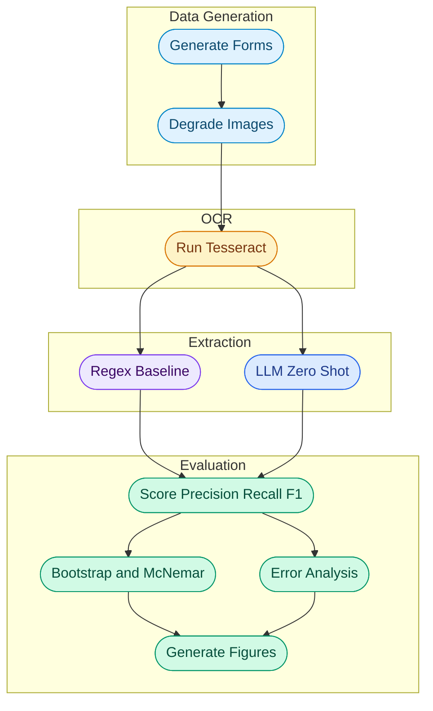

<div align="center">

# Kairo Health

### OCR Noise Effects on Medical Record Information Extraction


**University of Maryland, College of Information | INST664: Transforming Unstructured Content with AI | Final Project**

[Headline Findings](#headline-findings) · [Statistical Testing](#statistical-testing) · [Deployment Guide](#deployment-guide) · [Pipeline Stages](#pipeline-stages) · [Data and Sources](#data-and-sources)

---

</div>

## Project Overview

Kairo Health started from a question I have been carrying since cofounding Frontground, a startup focused on personalized mobile electronic medical records for low resource clinics. Mobile capture and cloud storage solve part of the problem, but they leave a harder upstream issue untouched: once you have a photo of a paper medical record, how do you actually use it? A blurry JPEG of a triage form is not the same as structured patient data. This project is a controlled study of that conversion step.

The pipeline generates synthetic pediatric triage forms modeled on the Médecins Sans Frontières Aweil Pediatric Triage form. Each form is rendered at five OCR noise tiers: clean, moderate, heavy, severe, and extreme. Tesseract OCR is then run on every image, and two extraction methods are compared on the OCR text: a rule based regex baseline and a zero shot LLM extractor using Claude Sonnet 4.5.

The evaluation reports precision, recall, and F1 at the field level and across noise tiers. It also adds bootstrap confidence intervals, McNemar significance tests, and per field error categorization for missing, substitution, hallucination, and layout artifact failures.

> **Core question:** As OCR input quality degrades across a controlled five tier noise spectrum, does LLM based field extraction stay more reliable than a rule based baseline, and where does each method break?

The headline finding is that the methods are statistically indistinguishable on clean and moderate inputs. The LLM shows a significant and growing advantage through heavy and severe noise. At extreme noise, both methods fail because OCR quality makes the document almost unreadable. The LLM also shows strong grounding behavior overall: across 2,100 field extraction attempts, only 4 hallucinations were observed, all at the two most degraded tiers.

---

## Headline Findings

| Noise | Sorted CER | Rules F1 | LLM F1 | Rules Recall | LLM Recall |
|---|---:|---:|---:|---:|---:|
| Clean | 0.32 | 0.93 | 0.91 | 0.90 | 0.91 |
| Moderate | 0.32 | 0.92 | 0.91 | 0.89 | 0.91 |
| Heavy | 0.48 | 0.86 | 0.91 | 0.77 | 0.90 |
| Severe | 0.80 | 0.58 | 0.67 | 0.42 | 0.54 |
| Extreme | 0.94 | 0.00 | 0.02 | 0.00 | 0.01 |

The recall column tells the clearest version of the story. From clean to heavy noise, LLM recall drops by only 1 point, from 0.91 to 0.90, while rules recall drops by 13 points, from 0.90 to 0.77. At severe noise, the gap widens: rules recall falls to 0.42 while LLM recall holds at 0.54. At extreme noise, both methods fail, but the rules method produces nothing at all while the LLM correctly refuses extraction on 99% of fields.

> **Note on CER:** Sorted CER measures character recognition quality after token sorting both the OCR output and reference text. This removes reading order penalties caused by Tesseract's column traversal. Raw CER is also computed and stored in `data/ocr_results.json`, but sorted CER is the cleaner metric for this analysis.

---

## Statistical Testing

Bootstrap confidence intervals with 1,000 paired resamples and McNemar exact tests confirm that the visual pattern in the headline table is statistically meaningful.

| Noise | LLM minus Rules F1 | 95% CI | Significant |
|---|---:|---|---|
| Clean | -0.013 | [-0.038, +0.010] | No |
| Moderate | -0.010 | [-0.031, +0.010] | No |
| Heavy | +0.042 | [+0.019, +0.066] | **Yes** |
| Severe | +0.092 | [+0.060, +0.122] | **Yes** |
| Extreme | +0.024 | [0.000, +0.058] | No |

The methods are statistically indistinguishable on clean and moderate inputs. The LLM advantage becomes significant at heavy and severe noise, with the largest gap at severe noise. At extreme noise, both methods are essentially broken, so the advantage disappears.

McNemar field level testing at heavy noise produced p = 7.4e-14, with 60 fields correct under LLM only versus 4 fields correct under rules only among the 64 disagreements. In other words, when these two methods see the same heavy noise input and disagree, the LLM is right 15 times out of 16.

See `results/bootstrap_ci.csv`, `results/bootstrap_diff.csv`, and `results/mcnemar.csv`.

---

## Deployment Guide

Error analysis at heavy, severe, and extreme noise categorizes each failure as missing, substitution, hallucination, or layout artifact.

| Category | Meaning |
|---|---|
| Missing | Method returned nothing even though gold had a value |
| Substitution | Method returned a wrong value that appears in the OCR text |
| Hallucination | Method returned a wrong value that does not appear in the OCR text |
| Layout artifact | Method returned nothing and the field label was absent from OCR text |

### Field Level Recommendation at Heavy Noise

| Field | Rules Errors | LLM Errors | Recommended |
|---|---:|---:|---|
| date | 0 | 0 | either |
| name | 0 | 0 | either |
| hr | 3 | 3 | either |
| muac | 2 | 2 | either |
| sat | 1 | 1 | either |
| weight | 1 | 1 | either |
| age | 3 | 0 | llm |
| ampm | 21 | 14 | llm |
| presenting_complaint | 2 | 0 | llm |
| rr | 2 | 0 | llm |
| time | 2 | 0 | llm |
| sex | 30 | 17 | llm |
| temperature | 7 | 5 | llm |
| triage_color | 30 | 5 | llm |

The LLM matches or beats the rules baseline on every field at heavy noise. The practical recommendation is to use regex only on fields where both methods reach zero errors because those fields are cheaper and deterministic. All other fields should route through the LLM.

**Safety caveat:** Of the LLM's 5 errors on `triage_color` at heavy noise, 4 were over triage, meaning GREEN was predicted as YELLOW, which is the safer direction. One was under triage, meaning RED was predicted as YELLOW. The rules method produced 30 missing values on the same field, which silently propagates as null triage data downstream. Both failure modes argue for human review of triage classifications in any real deployment.

### Hallucination Profile Across All Tiers

| Tier | LLM Hallucinations | Total Field Attempts |
|---|---:|---:|
| Clean | 0 | 420 |
| Moderate | 0 | 420 |
| Heavy | 0 | 420 |
| Severe | 2 | 420 |
| Extreme | 2 | 420 |
| **Total** | **4** | **2,100** |

There were zero hallucinations below severe OCR quality. At extreme noise, the LLM mostly refuses to extract rather than guessing from medical priors.

See `results/error_categories.csv` and `results/deployment_guide.csv`.

---

## Data and Sources

<details>
<summary><strong>Source Form</strong></summary>

<br>

The synthetic dataset is modeled on the MSF Aweil Pediatric Triage form, a clinical document used by Médecins Sans Frontières clinicians for pediatric triage in low resource settings. I selected this form because clinicians I interviewed during Frontground customer discovery, specifically at the MSF clinic in Monrovia, used a near identical variant.

| Property | Description |
|---|---|
| Source | MSF Medical Guidelines |
| Form name | MSF Aweil Pediatric Triage |
| Use context | Pediatric outpatient triage in low resource clinics |
| Structural regions | Header and patient identifiers, color coded clinical assessment grid, vitals table |

</details>

<details>
<summary><strong>Synthetic Data Generation</strong></summary>

<br>

Each form is filled with medically plausible patient data: ages sampled from a pediatric distribution, vitals in realistic ranges calibrated by age band, plausible presenting complaints, and triage classifications consistent with the sampled vital signs.

| Field Type | Examples | Count |
|---|---|---:|
| Header and identifiers | date, time, ampm, name, age, sex | 6 |
| Free text | presenting_complaint | 1 |
| Checkbox classification | triage_color | 1 |
| Numeric vitals | rr, hr, sat, temperature, weight, muac | 6 |
| Total evaluation fields | | **14** |

</details>

<details>
<summary><strong>OCR Noise Tiers</strong></summary>

<br>

Each PDF is rendered at five noise tiers through parameterized image degradation. Sorted CER measures character recognition quality independent of reading order differences between Tesseract output and the reference text.

| Tier | Rotation | Blur | Contrast | Smudges | Tint | Sorted CER |
|---|---:|---:|---:|---:|---|---:|
| Clean | 0deg | 0px | 1.00 | 0 | none | 0.32 |
| Moderate | 0.5deg | 0.5px | 0.85 | 0 | none | 0.32 |
| Heavy | 1.5deg | 1.0px | 0.70 | 0 | yellow +10 | 0.48 |
| Severe | 3.0deg | 1.5px | 0.55 | 3 | yellow +20 | 0.80 |
| Extreme | 5.0deg | 2.5px | 0.40 | 8 | yellow +30 | 0.94 |

</details>

<details>
<summary><strong>Techniques</strong></summary>

<br>

| Technique | Library | Purpose |
|---|---|---|
| PDF generation | reportlab | Synthesize triage form PDFs |
| PDF to image | pdf2image and poppler | Convert PDFs for OCR pipeline |
| Image degradation | PIL and numpy | Apply controlled noise per tier |
| OCR | pytesseract and Tesseract 5.x | Extract raw text from noisy images |
| OCR error metrics | jiwer | Raw CER, sorted CER, and word error rate |
| Rule based extraction | re | Baseline label anchored extraction |
| LLM extraction | Anthropic API and Claude Sonnet 4.5 | Zero shot JSON extraction |
| Statistical testing | scipy and numpy | Bootstrap confidence intervals and McNemar exact test |
| Evaluation | pandas, matplotlib, seaborn | Precision, recall, F1, heatmaps, and bar charts |

</details>

---

## Setup Instructions

### System Dependencies

```bash
# macOS
brew install tesseract poppler

# Ubuntu or Debian
sudo apt-get install tesseract-ocr poppler-utils
```

### Python Environment

```bash
git clone https://github.com/kennethyeaher/kairoHealth.git
cd kairoHealth
python -m venv .venv
source .venv/bin/activate
pip install -r requirements.txt
python -m spacy download en_core_web_sm
```

### API Key

```bash
cp .env.example .env
# edit .env and add your Anthropic key
```

Cost for the full 30 form, 5 tier pipeline is under $2 at current Claude Sonnet 4.5 pricing.

---

## Running the Project

```bash
python -m src.generate_forms    # PDFs and ground truth
python -m src.degrade_images    # five noise tiers per PDF
python -m src.run_ocr           # Tesseract plus raw and sorted CER
python -m src.extract_rules     # regex predictions
python -m src.extract_llm       # LLM predictions
python -m src.evaluate          # tables and figures
python -m src.significance      # bootstrap CIs and McNemar tests
python -m src.error_analysis    # failure categorization and deployment guide
```

---

## Code Package Structure

| Type | Path | Description |
|---|---|---|
| **Folder** | **`src/`** | **Pipeline modules** |
| File | `generate_forms.py` | Synthesizes MSF style triage PDFs |
| File | `degrade_images.py` | Renders PDFs at 5 OCR noise tiers |
| File | `run_ocr.py` | Runs Tesseract OCR with raw and sorted CER |
| File | `extract_rules.py` | Regex baseline extractor |
| File | `extract_llm.py` | Zero shot LLM extractor using Claude API |
| File | `evaluate.py` | Precision, recall, F1, tables, and figures |
| File | `significance.py` | Bootstrap confidence intervals and McNemar exact tests |
| File | `error_analysis.py` | Failure categorization and deployment guide |
| **Folder** | **`data/`** | **Pipeline data artifacts** |
| File | `ground_truth.json` | Field values for all 30 forms |
| File | `ocr_results.json` | Raw Tesseract output with CER per tier |
| Subfolder | `pdfs/` | Generated forms, gitignored and regeneratable |
| Subfolder | `images/` | Noisy renders, gitignored and regeneratable |
| **Folder** | **`results/`** | **Tables and figures** |
| File | `f1_comparison.csv` | Headline precision, recall, and F1 table across all 5 tiers |
| File | `per_field_f1.csv` | Per method, per noise, per field F1 |
| File | `ocr_calibration.csv` | Mean raw CER, sorted CER, and WER per tier |
| File | `predictions_rules.json` | Regex predictions for all 150 documents |
| File | `predictions_llm.json` | LLM predictions for all 150 documents |
| File | `bootstrap_ci.csv` | F1 with 95% CI per method per noise tier |
| File | `bootstrap_diff.csv` | Paired F1 difference with 95% CI per tier |
| File | `mcnemar.csv` | McNemar exact p value per noise tier |
| File | `error_categories.csv` | Failure counts by method, noise, field, and category |
| File | `deployment_guide.csv` | Recommended method per field at heavy noise |
| File | `f1_by_noise.png` | Headline F1 bar chart |
| File | `recall_by_noise.png` | Recall bar chart |
| File | `rules_field_heatmap.png` | Per field F1 heatmap for regex |
| File | `llm_field_heatmap.png` | Per field F1 heatmap for LLM |
| File | `config.py` | Paths, seeds, field schema, and noise configs |
| File | `requirements.txt` | Pinned dependencies |
| File | `.env.example` | Template for API key configuration |

---

## Pipeline Stages



---

<details>
<summary><strong>1. Generate Forms</strong></summary>

<br>

Synthesizes 30 pediatric triage form PDFs using reportlab. Each form is filled with medically plausible patient data sampled with a fixed random seed. The 14 evaluation fields per form are written to `ground_truth.json`.

</details>

<details>
<summary><strong>2. Degrade Images</strong></summary>

<br>

Renders each PDF at 200 DPI and applies one of five degradation pipelines parameterized in `NOISE_CONFIGS`. The output is 150 PNG images, made from 30 forms across 5 tiers. Smudge overlays are introduced at severe and extreme tiers to occlude characters entirely, pushing OCR from noisy text into missing text.

</details>

<details>
<summary><strong>3. Run OCR</strong></summary>

<br>

Runs Tesseract 5.x on each of the 150 images with light preprocessing: grayscale conversion plus 1.2x contrast. Computes raw CER, token sorted CER, and WER per document. Sorted CER is the primary calibration metric because it removes reading order penalties from Tesseract's column traversal.

</details>

<details>
<summary><strong>4. Rule Based Extraction</strong></summary>

<br>

Applies 14 regex patterns to the OCR text, one per evaluation field. Patterns are anchored on field labels and tuned on clean OCR output only. They are applied unchanged at all five noise tiers to preserve the realistic deployment story.

</details>

<details>
<summary><strong>5. LLM Extraction</strong></summary>

<br>

Sends each OCR text to the Anthropic API with a zero shot prompt requesting JSON output matching the field schema. The pipeline uses Claude Sonnet 4.5. The prompt does not ask the model to correct OCR errors. Hallucinated keys outside the schema are dropped during postprocessing and logged in the error analysis.

</details>

<details>
<summary><strong>6. Evaluate</strong></summary>

<br>

Computes true positives, false positives, and false negatives at the method by noise by field level. Wrong predictions count as both FP and FN because emitting a wrong value in a clinical context is more dangerous than emitting nothing. Aggregates produce headline precision, recall, and F1 per method per tier, plus per field heatmaps.

</details>

<details>
<summary><strong>7. Significance Testing</strong></summary>

<br>

Paired bootstrap with 1,000 resamples and seed 42 computes 95% confidence intervals on the LLM minus Rules F1 difference at each noise tier. A field level McNemar exact test counts off diagonal disagreements and reports an exact two sided binomial p value. Both tests run on the same scored document objects so the scoring convention is identical to `evaluate.py`.

</details>

<details>
<summary><strong>8. Error Analysis</strong></summary>

<br>

Categorizes every wrong prediction at heavy, severe, and extreme noise into missing, substitution, hallucination, or layout artifact. The deployment guide aggregates total errors per method per field and recommends the lower error method. Hallucination detection checks whether the predicted value appears anywhere in the OCR text for that document.

</details>

---

## Reproducibility

All randomness is seeded through `RANDOM_SEED = 42` in `config.py`.

| Stage | Reruns Identical | Notes |
|---|---|---|
| Form generation | Yes | Fully deterministic |
| Image degradation | Yes | Seeded random rotation and smudge placement |
| OCR | Yes | Tesseract is deterministic for fixed input |
| Regex extraction | Yes | Pure pattern matching |
| LLM extraction | No | API side sampling adds about 1 F1 point of variance |
| Evaluation | Yes | Pure aggregation |
| Significance testing | Yes | Seeded bootstrap generator |
| Error analysis | Yes | Deterministic categorization |

---

## Limitations

This is a synthetic data study on printed forms. Results should be read as an upper bound on extraction quality achievable with clean printed templates. Field performance on real handwritten triage records would almost certainly be lower for both methods.

The single under triage error, where RED was predicted as YELLOW by the LLM at heavy noise on `triage_color`, is a real safety concern and the clearest argument for mandatory human review of triage classifications. The rules method's 30 missing values on the same field are not safer because a null triage color silently propagates as default routing. Both failure modes argue against autonomous triage decisions from either method.

At extreme noise, where sorted CER is 0.94, both methods fail. The 4 LLM hallucinations observed in the full study are concentrated here. The near zero hallucination rate below extreme noise is a property of this specific prompt and noise range, not a guaranteed property of LLM extractors in general.

---

## Next Steps and Future Considerations

| Enhancement | Description | Impact |
|---|---|---|
| Real form pilot | Apply the pipeline to a small set of real deidentified triage forms | Test whether the synthetic to real gap matches expectations |
| Few shot LLM variant | Add 2 in context examples to the LLM prompt | Quantify the few shot improvement over zero shot |
| Handwriting OCR | Swap Tesseract for a handwriting capable OCR model such as TrOCR or Google Document AI | Address the largest gap between synthetic and real conditions |
| Vitals cross validation | Flag triage color predictions that contradict extracted vitals | Catch under triage errors without human review of every form |

---

<div>

## Author

**Kenneth Yeaher**  
Master of Information Management, Class of 2027  
University of Maryland, College Park  
[](https://www.linkedin.com/in/kennethyeaher/)

`Healthcare NLP` · `Information Extraction` · `OCR` · `LLM Evaluation`

</div>